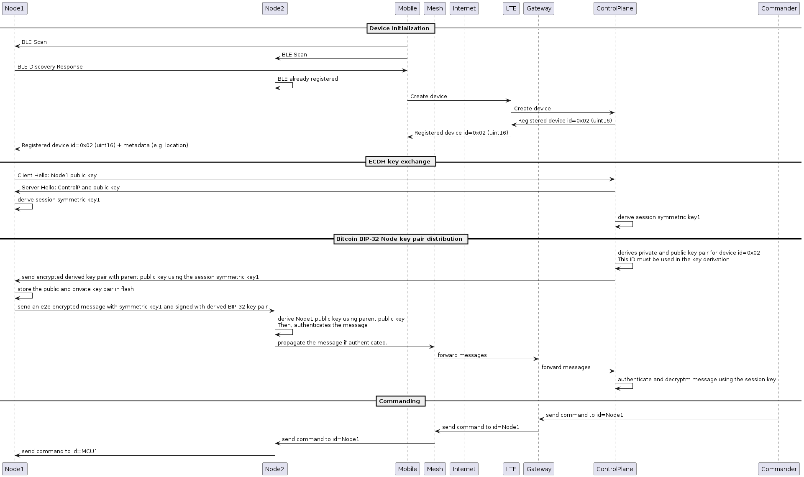

# Distributed Message Signing

In mesh network, message passings between node occur in a broadcast mode and connectionless. While this is great for network robustness, security can be challenging as any device can listen to any message being broadcasted in the mesh network and quickly flood the network with garbage data, causing a whole network DDOS attack. This document will address stopping unauthenticated data to be propagated to the mesh network, however jamming attacks are outside the scope as software can't solve this.

There are 2 core concepts to achieve distributed message signing:
  1. Sigv4: AWS signing and authentication process. It is hardened against replay attacks compared to JWT.
  2. Bitcoin BIP-32: think about a public private key pair tree.
  3. TLS: Cryptographic protocol that provides end-to-end security, commonly used on the web. 

## Acronyms

node: an IOT device that's a part of the mesh network that publishes sensors and receive commands from the control plane
control plane: a set of microservices that contain business logics to act on the data from nodes

## How it works?

Sigv4 has a specific sign generation process. However, this is basically a fancy way to make sure that the message is very secure, but the high level concept is still the same. Senders sign messages and receivers authenticate the messages. Sigv4 is usually used for web traffic between browsers to servers or servers to servers. The same concept can be applied to communications between nodes in the mesh network. For Sigv4 to work, the sender requires **a secret key to sign** and the receiver requires **the sender's public key pair to authenticate**.

Now, we know how to sign and authenticate messages on the edge. We need to figure out how to distribute public and private keys securely throughout all nodes in the mesh network. To achieve this, we'll borrow concepts from TLS and Bitcoin BIP-32. TLS is used for end-to-end encryption between a node and the control plane, any node in the mesh network or man in the middle won't be able to decrypt the data. Bitcoin BIP-32 is used for distributing trust between nodes.

## Reference

* Parent public key can deterministically derive a child public key with their index, https://bitcoin.stackexchange.com/questions/114407/can-i-verify-a-child-public-key-derived-from-its-parent-public-key-without-invol
